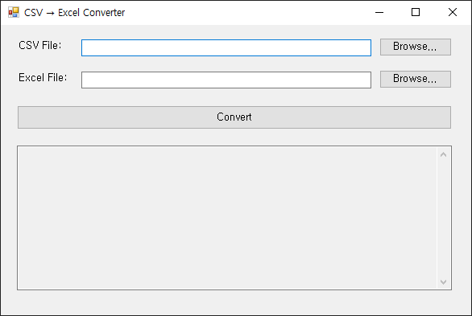
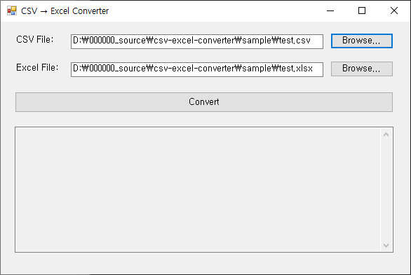
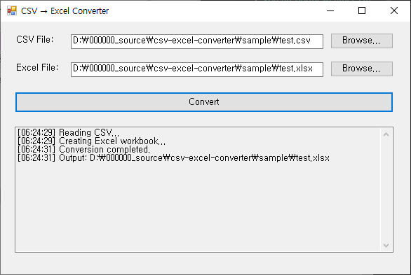

---

## Overview
Automates CSV↔Excel conversion for messy real-world data so reporting workflows stay consistent and reliable.

---

## What this is for
- Standardizing incoming datasets from multiple sources.
- Delivering clean, report-ready files with minimal manual steps.

---

## Key features
- Fast CSV to Excel and Excel to CSV conversion.
- Practical options for real reporting workflows.
- Clean output designed for downstream use.

---

## Edge cases handled
- Considers common encoding issues (e.g., UTF-8/UTF-8-SIG/CP949).
- Supports messy delimiters and uneven columns where applicable.
- Handles large files without breaking the output structure.

---

## Maintenance-ready by design
Uses a clear, modular pipeline so new formats, rules, or validation steps can be added safely.

---

## Features

- Convert CSV → Excel with one click  
- Auto‑fit Excel columns  
- Trim whitespace from fields  
- Console and UI versions included  
- WinForms UI with:
  - CSV file picker  
  - Excel output file picker  
  - Log panel showing progress  
- Includes sample CSV for testing

---

## Use Cases

- Convert legacy CSV exports into clean Excel workbooks
- Automate data cleaning for reports or dashboards
- Prepare datasets for accounting, finance, or analytics teams
- Replace manual Excel formatting tasks with automated processing
- Provide reusable tools for clients needing frequent CSV → XLSX conversion

---

## Tech Stack

- **C# / .NET**
- **ClosedXML** for Excel generation  
- **WinForms** (UI version)
- **File IO, DataTable, basic CSV parsing**

---

## Project Structure

```text
/csv-excel-converter
  /CsvExcelConverter.Console
  /CsvExcelConverter.WinForms
  /sample
    test.csv
    test.xlsx
  /screenshots
    01-main.png
    02-selected-file.png
    03-finished.png
```

---

## How to Use (WinForms)

1. Launch `CsvExcelConverter.WinForms.exe`
2. Click **Browse** to select a CSV file  
3. Excel output path auto‑fills  
4. Press **Convert**
5. Check the output `.xlsx` file  

---

## How to Use (Console)

```bash
dotnet run
```

Default paths:
```text
sample/test.csv
sample/result.xlsx
```

---

## Demo Video (YouTube)

[](https://youtu.be/8FqFwRIwlaU)

Watch a full demonstration of how the converter works,
including selecting a CSV file, generating an Excel output path,
and converting the data into a formatted .xlsx file using ClosedXML.

---

## Screenshots

| Main Window | CSV Selected | Excel Generated |
|------------|---------------------|----------------------|
|  |  |  |

---

## Sample CSV (included)

```csv
Name,Email,Age,Country,IsActive
Alice,alice@example.com,30,USA,true
Bob,bob@example.com,,Canada,false
Charlie , charlie@example.com , 35 , South Korea , true
David, Jr.,david.jr@example.com,28,UK,true
Eve,eve@example.com,41,USA,false
```

---

## Limitations

- Simple CSV parser (does not fully support quoted comma fields)
- No type conversion (all fields are string)
- If needed, I can upgrade this to CsvHelper-based parsing
  
---

## Future Improvements

- Add CsvHelper for robust parsing
- Most requested by clients batch multi‑file conversion
- Column type detection
- Add dark/light UI themes

---

## License

MIT License
Copyright (c) 2025
